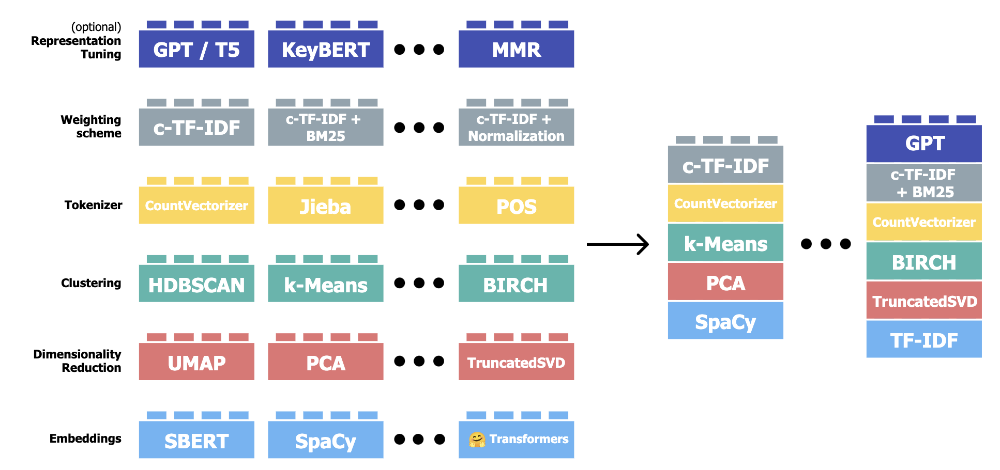
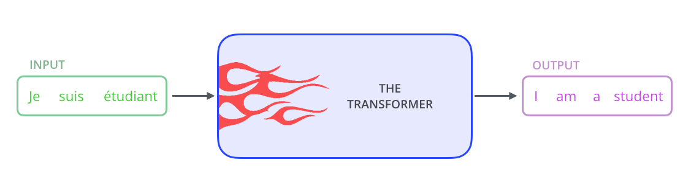

```{r echo=F, message=F}
knitr::opts_chunk$set(fig.width=12, fig.height=8, echo=T, warning=FALSE, message=FALSE, root.dir='/Users/bennettkleinberg/GitHub/snlp/data')

library(quanteda)
library(data.table)
library(caret)
```

##  {.sectiontitle}

Sentiment analysis

## Aim

Measuring the emotional tone (sentiment) that is expressed in a document.

-   categorical: positive, neutral, negative
-   continuous sentiment: e.g., -3.17, 1.89

Closely related to emotion analysis.

## Main approaches

1.  Pre-defined word lists (lexicons)
2.  Pre-trained models

## Basic sentiment analysis

1.  tokenise text
2.  construct a lexicon of sentiment words
3.  judge the sentiment words
4.  match tokens with sentiment lexicon

Example: travel blogs (LLM generated)

## 1. tokenisation

```{r}
blogs = fread('/Users/bennettkleinberg/GitHub/snlp/data/travel_blogs.csv')

example_1 = tokens(blogs$gpt_content[1])
```

> Title: A Whirlwind Journey Through the UK: From Sunshine to Rainclouds and Back to Sunshine\*\*\n\n---\n\nAh, the United Kingdom! A land steeped in history, culture, and the promise of endless adventure. As I touched down at Heathrow Airport, the excitement surged through me like a bolt of lightning.[...]

## 2. lexicon of sentiment words

-   do all words have a potential sentiment?
-   maybe focus on adjectives/adverbs, maybe verbs?

Many sentiment lexicons already exist

## 2. lexicon of sentiment words

The `lexicon` [package](https://github.com/trinker/lexicon)

```{r}
head(lexicon::hash_sentiment_nrc[, 1], 10)
```

## lexicon::hash_sentiment_nrc

```{r}
head(lexicon::hash_sentiment_slangsd[, 1], 10)
```

## lexicon::hash_sentiment_socal_google

```{r}
head(lexicon::hash_sentiment_socal_google[,1], 10)
```

## 3. judge the sentiment words

Common strategy

-   crowdsourced annotation
-   decide on a judgment scale
-   multiple judgments per word
-   assess inter-rater reliability

## 3. judge the sentiment words

Again: mostly already done for you

```{r}
head(lexicon::hash_sentiment_nrc, 10)
```

Binary judgment: -1 or 1

## Scale judgments

```{r}
head(lexicon::hash_sentiment_slangsd, 10)
```

Finer judgment: -1.00, -0.50, 0.50, 1.00

## Continuous judgment

```{r}
head(lexicon::hash_sentiment_socal_google, 10)
```

## 4. match tokens with sentiment lexicon

One sentiment score for each sentence.

```{r}
sentiment_table = sentimentr::sentiment(text.var = blogs$gpt_content[1]
                      , polarity_dt = lexicon::hash_sentiment_nrc)


```

For document-level sentiment: match words from sentiment lexicon, then calculate the average sentence sentiment for a document.

## Document-level sentiment

```{r}
sentiment_table[, mean(sentiment), .(element_id)]
```

## Valence shifters

-   1 = negator (not, never, ...)
-   2 = amplifier (very, totally, ...)
-   3 = deamplifier (hardly, barely, ...)
-   4 = adversative conjunction (but, however, ...)

## Within the `lexicon` package

```{r}
lexicon::hash_valence_shifters
```

## Control these in the `sentiment` function

```{r}
sentiment_table_2 = sentimentr::sentiment(text.var = blogs$gpt_content[1]
                      , polarity_dt = lexicon::hash_sentiment_nrc
                      , valence_shifters_dt = lexicon::hash_valence_shifters
                      , amplifier.weight = 0.8
                      , adversative.weight = 0.25
                      , n.before = 2
                      , n.after = 2)


sentiment_table_2
```

## Different setups

```{r}
sentimentr::sentiment(text.var = blogs$gpt_content[1]
                      , polarity_dt = lexicon::hash_sentiment_nrc
                      , valence_shifters_dt = lexicon::hash_valence_shifters
                      , amplifier.weight = 0.8
                      , adversative.weight = 0.25
                      , n.before = 5
                      , n.after = 5)
```

## No valence shifters

```{r}
sentimentr::sentiment(text.var = blogs$gpt_content[1]
                      , polarity_dt = lexicon::hash_sentiment_nrc
                      , valence_shifters_dt = NULL)
```

## Different sentiment word list

```{r}
sentimentr::sentiment(text.var = blogs$gpt_content[1]
                      , polarity_dt = lexicon::hash_sentiment_sentiword
                      , valence_shifters_dt = lexicon::hash_valence_shifters
                      , amplifier.weight = 0.8
                      , adversative.weight = 0.25
                      , n.before = 5
                      , n.after = 5)
```

## Locate sentences

```{r}
sentimentr::get_sentences(blogs$gpt_content[1])
```

##  {.sectiontitle}

Dictionaries in general

## Idea

Word matching (lookup in reference list).

Common for psycholinguistic constructs (e.g., LIWC).

## 

LIWC example

## Your own dictionary

Suppose you want to create your own dictionary:

-   to measure "hype" in academic writing
-   with a list of words that belong to higher-order categories

Taken from: @millar2022

*Beware of the validity trap!*

## Creating a dictionary in R

```{r eval=F}
hype_dict = quanteda::dictionary(list(importance = c("compelling", "critical", "crucial", "essential",  "foundational" , "fundamental", "imperative", "important", "indispensable", "invaluable", "key", "major", "paramount", "pivotal", "significant","strategic" , "timely", "ultimate", "urgent", "vital")
                                      , novelty = c("creative" , "emerging" , "first" , "groundbreaking", "innovative", "latest", "novel", "revolutionary" , "unique" , "unparalleled" ,  "unprecedented")
                                      , rigor = c("accurate", "advanced", "careful", "cohesive" , "detailed", "nuanced", "powerful", "quality", "reproducible", "rigorous", "robust", "scientific", "sophisticated", "strong", "systematic")
                                      )
                                 )
```

## Store this as a YAML (.yml) file

```{r eval=F}
write_yaml(x = hype_dict
           , file = './hype_dict.yaml')
```

## Using your dictionary

```{r}
library(quanteda)

hype_dict = dictionary(file = "/Users/bennettkleinberg/GitHub/snlp/data/hype_dict.yml")

c1 = corpus(blogs$gpt_content)

c_tok = tokens(c1
               , remove_punct = T)

c_dfm = dfm(c_tok
            , tolower = T)

dict_match = dfm_lookup(c_dfm
                 , dictionary = hype_dict
                 , valuetype = 'glob')

dict_match

```

## Now: PRACTICAL III

-   sentiment analysis
-   wider emotion analysis
-   working with existing dictionaries
-   creating your own dictionary

##  {.sectiontitle}

Word embeddings

## Idea

Capturing semantics of words.

Without any supervision.

<small>Based on our EuroCSS workshop: [A Gentle Introduction to Word Embeddings for the Computational Social Sciences](https://maximilianmozes.github.io/word-embeddings-workshop/)</small>

## Abstraction of the problem

A single word can have different meanings:

-   Death in Venice is my favorite **novel**.
-   He came up with a **novel** idea.

Different meaning depending on context:

-   Don't use the trackpad, just use your **mouse**.
-   My cat just caught a **mouse**.

## Word representations

-   we can represent textual data as vectors
-   each word can thus be placed in a vector space

Aim of word embeddings: move related words closer in vector space than unrelated words

## One-hot word encoding

```{r message=F, echo=T}
corpus_b = corpus(blogs$gpt_content[1:50])
dfm_2 = dfm(tokens_ngrams(tokens_select(x = tokens(corpus_b
                                                   , remove_punct = T
                                                   , remove_symbols = T)
                                        , pattern=stopwords('en')
                                        , selection= 'remove') , n=1))
t(dfm_2)
```

## Problem

Similarity between two one-hot encoded vectors is 0.

This is because we need the dot-product of the vectors:

$\text{cosine similarity}(\mathbf{A}, \mathbf{B}) = \frac{A \times B}{\sqrt{A \times A} * \sqrt{B \times B}}$

**We need a different representation of words.**

## Enter: word embeddings

-   Instead of using one-hot vectors, assign each word to a dense vector representation
-   If two words are semantically similar, their dot product should be high

*How do we find those embeddings?*

## Original approaches

-   Glove @pennington2014
-   Word2Vec @mikolov2013

## Word2Vec

-   Skip-gram: given a specific word, estimate probability of context words
-   Continuous-bag-of-words: given a set of context words, predict the center word

(for details, see the [EuroCSS slides](https://github.com/maximilianmozes/word_embeddings_workshop_resources/blob/master/slides/theo.pdf))

## Glove (Global Vectors)

-   Based on co-occurrences

```{r}
ex_c = corpus(tolower(blogs$gpt_content[1:20]))
fcm(tokens_select(x = tokens(ex_c
                             , remove_punct = T
                             , remove_symbols = T)
                  , pattern=stopwords('en')
                  , selection= 'remove')
    , tri=F)
```

## For both approaches

-   we fit a model that helps us obtain dense representations of each word
-   word2vec: capture local context many times
-   Glove: capture global context once

Both rely on the distributional hypothesis @harris1954: "words occurring in the same context tend to have similar meanings"

## Working with Glove embeddings

## 

```{r warning=F}
source('/Users/bennettkleinberg/GitHub/snlp/data/init_glove.R')

init_glove(dir = '/Users/bennettkleinberg/Documents/glove'
           , which_model = '6B'
           , dim=300)
```

## The embeddings dfm

```{r}
dim(glove.pt)

rownames(glove.pt)[200:210]
```

## Retrieving embeddings

```{r}
university_emb = as.vector(glove.pt[row.names(glove.pt) == 'university', ])
university_emb
```

## Nearest neighbours

```{r warning=F}
library(quanteda.textstats)

cos_sim_vals = textstat_simil(glove.pt
                              , selection = c("university"
                                              , "beach"
                                              , "bank")
                              , margin = "documents"
                              , method = "cosine")
```

## Top 25 neighbours for "university"

```{r}
head(sort(cos_sim_vals[,1], decreasing = TRUE), 25)
```

## Top 25 neighbours for "beach"

```{r}
head(sort(cos_sim_vals[,2], decreasing = TRUE), 25)
```

## Top 25 neighbours for "bank"

```{r}
head(sort(cos_sim_vals[,3], decreasing = TRUE), 25)
```

## Arithmetics with word embeddings

What if we could do "maths with meaning"?

Do semantic relationships hold true in embeddings?

## BERLIN - GERMANY + FRANCE

If: $\vec{BERLIN} \approx BERLIN$

$\frac{\vec{GERMANY}}{\vec{BERLIN}} :: \frac{\vec{FRANCE}}{\vec{?}}$

```{r}
berlin = as.vector(glove.pt[row.names(glove.pt) == 'berlin', ])
germany = as.vector(glove.pt[row.names(glove.pt) == 'germany', ])
france = as.vector(glove.pt[row.names(glove.pt) == 'france', ])
```

## 

```{r}
mystery_1 = berlin - germany + france
mystery_1
```

## Clostest neighbours to that vector?

```{r warning=F}
mystery = data.frame(matrix(mystery_1, nrow = 1, byrow = T))
names(mystery) = featnames(glove.pt)
mystery_dfm = as.dfm(mystery)

glove.pt = rbind(glove.pt, mystery_dfm)
row.names(glove.pt)[400001] = c('mystery_1')

cos_sim_vals_mystery = textstat_simil(glove.pt
                              , selection = c("mystery_1")
                              , margin = "documents"
                              , method = "cosine")
```

## 

```{r}
head(sort(cos_sim_vals_mystery[,1], decreasing = TRUE), 10)
```

## Dynamic embeddings

But: Glove and Word2Vec are still static embeddings.

-   new embeddings require re-training the models (and this requires substantial amounts of text data)
-   enter: **Bidirectional Encoder Representations from Transformers (BERT)** @devlin2019
-   Aim: capturing contextual-dependencies (key: bidirectional context and attention mechanism)

## Workflow of current embeddings approaches

-   large pre-trained language model (BERT, GPT, Llama)
-   these models are trained to arrive at embeddings for sequences of words
-   for a given input sequence, the models produce an embeddings representation
-   For R: [RBERT](https://github.com/jonathanbratt/RBERT)

## Via OpenAI with `rgpt3`

-   we can also obtain text embeddings from the GPT models
-   requires an API key!
-   Package on GitHub: <https://github.com/ben-aaron188/rgpt3>

```{r eval=F}
devtools::install_github("ben-aaron188/rgpt3")
library(rgpt3)
rgpt_authenticate("/Users/bennettkleinberg/GitHub/rgpt3/R/access_key.txt")
```

## Obtaining embeddings from the GPT models

Dataset: narratives expressing worries about the pandemic @kleinberg_measuring_2020, @aref_women_2020, @vandervegt2023, @mozes_repeated-measures_2021

```{r}
rwwd = fread('/Users/bennettkleinberg/GitHub/snlp/data/real_world_worry_waves_dataset.csv')
```

## 

```{r eval=F}
rwwd_emb = rgpt_embeddings(input_var = rwwd$text_long_wave1
                                , id_var = rwwd$id
                                , param_dimensions = 256)

[1] "Embedding: 1/1152"
[1] "Embedding: 2/1152"
[1] "Embedding: 3/1152"
[1] "Embedding: 4/1152"
[1] "Embedding: 5/1152"
[1] "Embedding: 6/1152"
```

## Resulting embeddings

```{r echo=F}
rwwd_emb = fread('/Users/bennettkleinberg/GitHub/snlp/data/rwwd_embeddings.csv')
rwwd_emb
```

## Recap: embeddings

-   game-changer in NLP
-   transition from static embeddings (Glove, Word2Vec) to contextualised embeddings (BERT)
-   very powerful for prediction
-   current benchmark for capturing semantics in text representations
-   but: data-hungry, unstable, non-interpretable (see [EuroCSS slides](https://github.com/maximilianmozes/word_embeddings_workshop_resources/blob/master/slides/limitations.pdf))

##  {.sectiontitle}

Topic modelling

## Aim

-   uncover hidden themes in a collection of documents
-   assumption: each document is a mixture of topics, and each topic is a distribution over words

## Two important approaches

1.  Latent Dirichlet Allocation (LDA)
    -   Document generation assumption: topics are first selected, then words are chosen from those topics
    -   Bag-of-words approach: LDA ignores word order and context
    -   the focus is on *document-term frequency* and *co-occurrences* within documents
    -   key challenge: finding words that belong to the $k$ topics

In R: the [stm package for Structural Topic Modelling](https://cran.r-project.org/web/packages/stm/vignettes/stmVignette.pdf)

## Two important approaches

2.  Embeddings-based topics
    -   each document is represented by an embeddings vector
    -   clustering approaches find *clusters* ($\approx$ topics) in the corpus of documents
    -   TF-IDF is used to find central words for each cluster

Excellent approach: [BERTopic](https://maartengr.github.io/BERTopic/index.html) @grootendorst2022

## BERTopic {.centerme}

{width="80%"}

## k-means clustering

```{r warning=F}
wss = numeric()
for(i in 1:20){
  kmeans_model = kmeans(rwwd_emb
                        , centers = i
                        , iter.max = 20
                        , nstart = 10)
  wss[i] = kmeans_model$tot.withinss
}
plot(1:20, wss, type='b', xlab='k clusters', ylab='WSS')
```

## Silhoutte method

```{r}
factoextra::fviz_nbclust(rwwd_emb, kmeans, method = "silhouette")
```

## Fit k-means model

```{r}
kmeans_model_k_2 = kmeans(rwwd_emb
                          , centers = 2
                          , iter.max = 20
                          , nstart = 10)

# add topic clusters
rwwd$topic = kmeans_model_k_2$cluster
```

## Create a grouped corpus by topics

```{r}
rwwd_corpus = corpus(rwwd$text_long_wave1
                          , docvars = data.frame(cluster = rwwd$topic))

rwwd_corpus_grouped = corpus_group(rwwd_corpus
                                        , groups = cluster)

rwwd_corpus_grouped
```

## TF-IDF weighting of grouped corpus

```{r}
toks = tokens(tolower(rwwd_corpus_grouped)
              , remove_punct = T
              , include_docvars = T)

toks = tokens_select(toks
                     , pattern = stopwords('en')
                     , selection = 'remove')

ngrams = tokens_ngrams(x = toks
                       , n= 1:3)

dfm_1 = dfm_trim(dfm(ngrams)
                 , min_docfreq = 0.01
                 , docfreq_type = 'prop')

dfm_2 = dfm_wordstem(dfm_1)
```

## 

```{r}
dfm_2
```

## Top TF-IDF terms by topic

```{r}
dfm_tfidf = dfm_tfidf(dfm_2
                      , scheme_tf = "count"
                      , scheme_df = "inverse")

topfeatures(dfm_tfidf, groups = cluster, n = 20)
```

## Recap: topic modelling

-   seeks to identify hidden (latent) themes in documents
-   various approaches to do this (e.g., DFM-based and embeddings-based)
-   challenges: dimensionality, choosing $k$, dealing with non-assignable documents, labelling topics

##  {.sectiontitle}

Supervised learning with textual data

## Aim

-   make predictions from $text \rightarrow outcome$
-   plenty of examples with numerical data
-   with textual data: always via text quantification first!

*This is where a lot of the hope on textual data lies.*

## Text quantification approaches

Main approaches:

1.  Term frequency-based (ngrams): e.g., DFM, TFIDF
2.  Dictionary-based: e.g., LIWC @boyd2022
3.  Embeddings-based: e.g., SBERT @reimers2019, Universal Sentence Encodings @cer_universal_2018

*Supervised learning implies labelled data!*

## Common logic

Steps in text classification:

1.  split the data into a training and test set
2.  train an algorithm on the training set (incl. cross-validation)
3.  evaluate your final model on the test set
4.  report performance metrics on the test set

## Machine learning flow in `caret`

```{r eval=F}
library(caret)

set.seed(123)

in_training = createDataPartition(y = data_ml$REWRITTEN
                                  , p = .8
                                  , list = FALSE)

training_data = data_ml[in_training, ]
testing_data = data_ml[-in_training, ]

model_svm = train(outcome_class ~ .
                  , data = training_data
                  , method = "svmLinear"
                  , trControl = trainControl(method = 'cv', number=5)
                  , preProcess = c('nzv'))

model_svm_pred = predict(model_svm, testing_data)

confusion_matrix = confusionMatrix(model_svm_pred, testing_data$outcome_class)
```

## Example

Dataset of truthful and deceptive narratives about weekend plans @kleinberg2021

```{r}
truth_lie =  fread('/Users/bennettkleinberg/GitHub/snlp/data/sign_events_data_statements.csv')

truth_lie[, .N, .(outcome_class)]
```

## Key challenge in text classification

*Which text quantification (features) do we use?*

Let's see how this works with a DFM and with embeddings.

## DFM as features

```{r}
truth_lie_corpus = corpus(truth_lie$q1
                          , docvars = data.frame(TL = truth_lie$outcome_class))

toks = tokens(tolower(truth_lie_corpus)
              , remove_punct = T
              , include_docvars = T)

toks = tokens_select(toks
                     , pattern = stopwords('en')
                     , selection = 'remove')

ngrams = tokens_ngrams(x = toks
                       , n= 1:3)

dfm_truth_lie = dfm_trim(dfm(ngrams)
                 , min_docfreq = 0.01
                 , docfreq_type = 'prop')

dfm_truth_lie_2 = dfm_wordstem(dfm_truth_lie)
```

## 

```{r}
dfm_truth_lie_2
```

## Using that DFM in `caret`

```{r}
# covert the dfm to a data.frame
data_ml = convert(dfm_truth_lie_2, to = 'data.frame')

# add the outcome variable (target variable) from the docvars
data_ml$TL = as.factor(dfm_truth_lie_2$TL)

# remove the "doc_id" variable
data_ml = data_ml[, -c(1)]

names(data_ml)
```

## Splitting the data

```{r}
set.seed(123)

in_training = createDataPartition(y = data_ml$TL
                                  , p = .8
                                  , list = FALSE)

training_data = data_ml[in_training, ]
testing_data = data_ml[-in_training, ]
```

## Training on the training set

```{r}
model_svm = train(TL ~ .
                  , data = training_data
                  , method = "svmLinear"
                  , trControl = trainControl(method = 'cv', number=5)
                  , preProcess = c('nzv'))
```

## Evaluating the model on the test set

```{r}
model_svm_pred = predict(model_svm, testing_data)

confusionMatrix(model_svm_pred, testing_data$TL)
```

## Most diagnostic features

```{r}
varImp(model_svm)
```

## Embeddings as features

```{r}
truth_lie_emb = fread('/Users/bennettkleinberg/GitHub/snlp/data/truth_lie_embeddings.csv')

data_ml = merge(truth_lie_emb, truth_lie[, c("outcome_class", "id")], by='id')

# set the same variable name as above
data_ml$TL = as.factor(data_ml$outcome_class)

# remove the "id" and "outcome_class" variable
data_ml = data_ml[, -c("id", "outcome_class")]

names(data_ml)
```

## Splitting and training

```{r}
set.seed(123)

in_training = createDataPartition(y = data_ml$TL
                                  , p = .8
                                  , list = FALSE)

training_data = data_ml[in_training, ]
testing_data = data_ml[-in_training, ]

model_svm = train(TL ~ .
                  , data = training_data
                  , method = "svmLinear"
                  , trControl = trainControl(method = 'cv', number=5)
                  , preProcess = c('nzv'))
```

## Evaluating

```{r}
model_svm_pred = predict(model_svm, testing_data)

confusionMatrix(model_svm_pred, testing_data$TL)
```

## Are the top features meaningful here?

```{r}
varImp(model_svm)
```

##  {.sectiontitle}

Transformers (brief overview)

## GPT-3

The model in an abstract sense.

-   175 billion parameter model trained on 300 billion tokens [@NEURIPS2020_1457c0d6]
-   training data size: 45 TB text data
-   used for question answering, text summarisation, classification, etc.
-   very controversial when announced
-   core idea: instructing the model with *prompts* (=conditioning its probability function $p(x_n | x_1, x_2, ..., x_{n-1})$)

More specifically...

## Transformer models {.centerme}

Key idea: GPT-3 is a transformer model [@vaswani2017attention]

It's a sequence-to-sequence (seq2seq) model



<small>[All image credit to: Jay Alammar](https://jalammar.github.io/illustrated-transformer/)</small>

## Encoder-decoder model {.centerme}


## Stacked encoders and decoders {.centerme}


## Attention mechanism {.centerme}


## Autoregressive text generation

Some examples?

## Now: PRACTICAL IV

-   working with Glove embeddings
-   emotion prediction
-   full text classification pipeline

## References